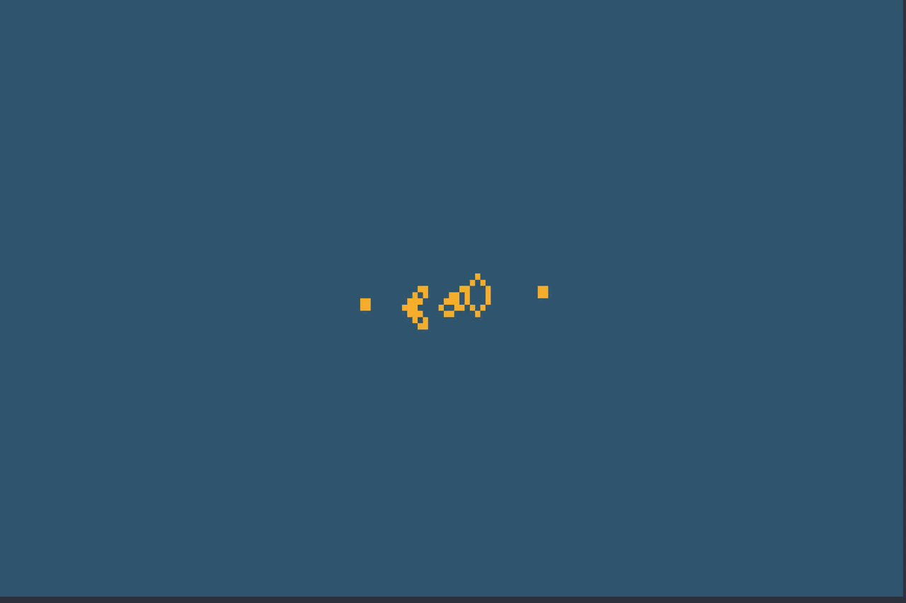

# GliPy-cli

`GliPy-cli` is a command line front-end interface for [glipy](https://github.com/noprobelm/glipy), a [Cellular Automaton](https://en.wikipedia.org/wiki/Cellular_automaton) [Game of Life](https://en.wikipedia.org/wiki/Conway%27s_Game_of_Life) library written in Python.

`glipy-cli` can render any Conway cellular automaton directly to your terminal emulator.

## Features
- Visualize Conway's Gameo f Life automatons directly from `.life`, `.rle` pattern files, or from a remote URL that points to a valid `.rle` (widely available on [LifeWiki](https://conwaylife.com/wiki))
- Select any range of hex colors for cell states

## Command Line Options

Quickly render a random simulation by running `glipy-cli` in your terminal.

`glip-cli` has several command line options
| Option                          | Description                                                                                                                         |
|:--------------------------------|:------------------------------------------------------------------------------------------------------------------------------------|
| \<target\> [positional; optional] | If no target is passed, render a random simulation. Accepts paths to .rle/.life, or remote URL to rle format                        |
| -r --refresh-rate               | Specify a refresh rate (generations/second)                                                                                         |
| -g --generations                | The number of generations a simulation should run for (default ∞)                                                                   |
| -c --colors                     | Specify colors for dead/alive cells (accepts hex or [ANSI color codes](https://rich.readthedocs.io/en/stable/appendix/colors.html)) |
| -x --debug                      | Enter debug mode. This will turn off terminal rendering and provide performance metrics after the simulation is terminated          |
| -n --no-render                  | Do not render the simulation (debug will automatically trigger this)                                                                |

## Examples

Random Conway Soup: `glipy-cli`

Gosper Glider Gun: `glipy-cli https://conwaylife.com/patterns/gosperglidergun.rle`

Cloverleaf Interchange hassled by carnival shuttles: `glipy-cli https://conwaylife.com/patterns/p12cloverleafhassler.rle`

Use custom colors from ANSI/hex codes: `glipy-cli https://conwaylife.com/patterns/387p132pattern.rle --colors "#81A1C1 #3B4252"`

